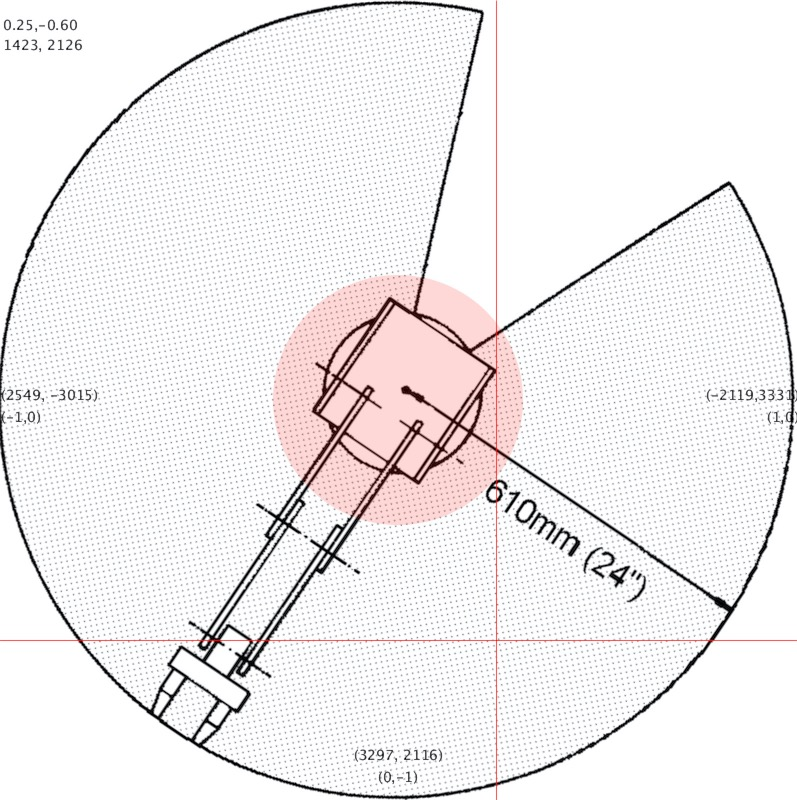

# Scorbot

Processing code to control Scorbot-ER V plus by using the mouse.

```java
float xx = map(mouseX, 0, width, -1, 1);
float yy = map(mouseY, 0, height, 1, -1);
coordinate = new PVector(xx, yy);
coordinate.rotate(radians(-236));
coordinate.mult(3947); //= straal = dist(0,0,1,0)
coordinate.limit(3947);
//...
cmd("setpvc 1 x "+round(coordinate.x));
cmd("setpvc 1 y "+round(coordinate.y));
cmd("move 1");
//...
```


